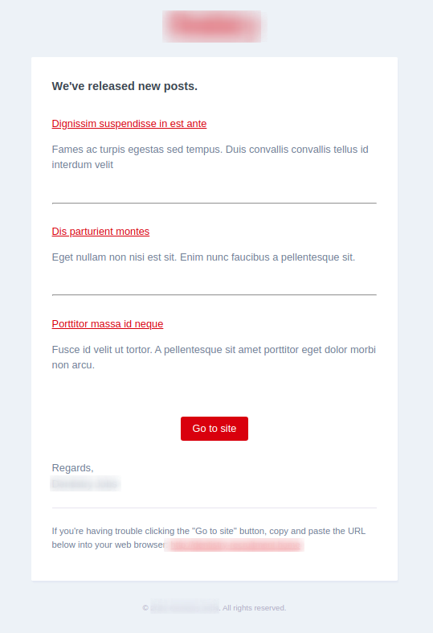

# Laravel periodic notifications batch

[](https://github.com/yaroslawww/laravel-periodic-notice/blob/main/LICENSE.md)
[](https://packagist.org/packages/yaroslawww/laravel-periodic-notice)
[](https://packagist.org/packages/yaroslawww/laravel-periodic-notice)
[](https://scrutinizer-ci.com/g/yaroslawww/laravel-periodic-notice/build-status/main)
[](https://scrutinizer-ci.com/g/yaroslawww/laravel-periodic-notice/?branch=main)
[](https://scrutinizer-ci.com/g/yaroslawww/laravel-periodic-notice/?branch=main)

Send your periodical series to user as batch using notifications.



## Installation

Install the package via composer:

```bash
composer require yaroslawww/laravel-periodic-notice
```

You can publish the assets file with:

```bash
php artisan vendor:publish --provider="PeriodicNotice\ServiceProvider" --tag="config"
php artisan vendor:publish --provider="PeriodicNotice\ServiceProvider" --tag="lang"
```

To disable default migrations add this code to app service provider:

```injectablephp
\PeriodicNotice\PeriodicNoticeManager::ignoreMigrations()
```

## Usage

```injectablephp
use PeriodicNotice\Concerns\HasPeriodicNotice;
use PeriodicNotice\Contracts\NotificationReceiver;
use PeriodicNotice\PeriodicNoticeDirector;

class User extends \Illuminate\Foundation\Auth\User implements NotificationReceiver
{
    use Notifiable;
    use HasPeriodicNotice;

    public function periodicNoticeDirector(string $group = 'default'): PeriodicNoticeDirector
    {
        $dayInSeconds = 60 * 60 * 24;

        return PeriodicNoticeDirector::defaults($group)
                                     ->usePeriodType($this->periodic_notification_type)
                                     ->usePeriodTypesMap([
                                         'every_day'  => round($dayInSeconds),
                                         'every_week' => round($dayInSeconds * 7),
                                     ])
                                     ->useQueryToGetEntries(Post::class);
    }

    public function scopeWithNotificationPeriodType(Builder $query, string $type, string $group = 'default')
    {
        $query->where('periodic_notification_type', '=', $type);
    }
}
```

```injectablephp
use Illuminate\Database\Eloquent\Builder;
use Illuminate\Database\Eloquent\Model;
use PeriodicNotice\Concerns\InPeriodicNotice;
use PeriodicNotice\Contracts\SendableEntity;
use PeriodicNotice\Tests\Fixtures\Factories\PostFactory;

class Post extends Model implements SendableEntity
{
    use InPeriodicNotice;

    public function scopeReleasedAfter(Builder $query, \DateTimeInterface|string $dateTime, string $group)
    {
        $query->where('published_at', '>=', $dateTime);
    }
}
```

Manual call

```shell
php artisan periodic-notice:send:batch every_day \\App\\Models\\User
# or use morph alias
php artisan periodic-notice:send:batch every_day user
# use custom group
php artisan periodic-notice:send:batch every_day user -G custom_group
```

More appropriate way is using cron schedule

```injectablephp
$schedule->command('periodic-notice:send:batch every_day user')
          ->dailyAt('18:00');
```

## Credits

- [](https://think.studio/)
